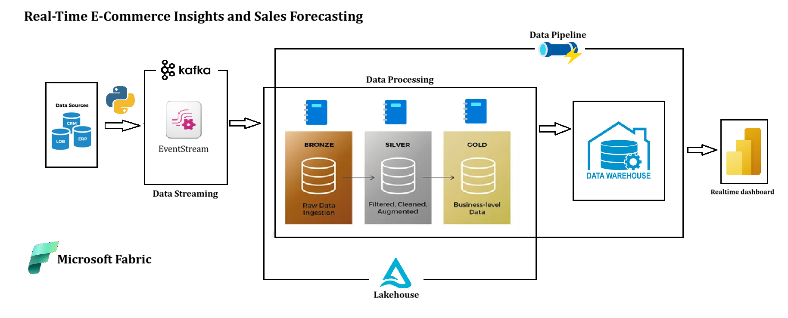
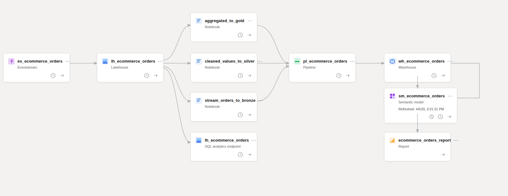
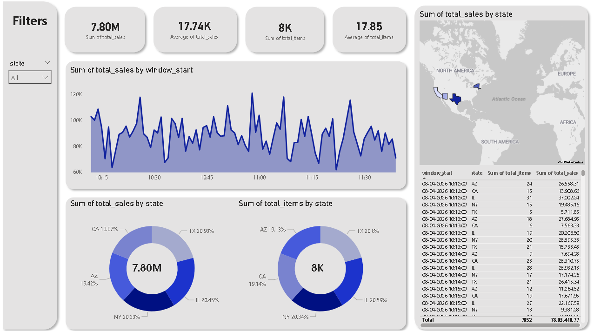

# 🛒 Real-Time E-Commerce insights and sales forecasting

<div align="center">


**A production-grade, end-to-end real-time data streaming and analytics pipeline built on Microsoft Fabric — simulating live e-commerce order data from ingestion to interactive Power BI dashboards.**

[Architecture](#-architecture) • [Tech Stack](#-tech-stack) • [Pipeline Layers](#-pipeline-layers) • [Getting Started](#-getting-started) • [Project Structure](#-project-structure)

</div>

---

## 📌 Project Overview

This project implements a complete **real-time streaming data pipeline** for e-commerce insights and sales forecasting. Fake order data is continuously generated using Python and streamed via **Apache Kafka** into **Microsoft Fabric Eventstream**, where it flows through a **Medallion Architecture** (Bronze → Silver → Gold) before being served to a live **Power BI dashboard**.

The entire workflow is orchestrated by a **Fabric Pipeline** that can be scheduled or triggered on demand.

---

## 🏗️ Architecture

### Project Architecture



### Data Flow Diagram

```
                    ┌─────────────────────────────────────────────────────────────────────────┐
                    │                         DATA GENERATION                                 │
                    │                                                                         │
                    │   Python + Faker + Kafka Producer                                       │
                    │   └── Simulates real-time e-commerce orders (order_id, customer,        │
                    │       product, price, quantity, city, state, delivery_status ...)       │
                    └───────────────────────────┬─────────────────────────────────────────────┘
                                                │ Kafka Topic
                                                ▼
                    ┌─────────────────────────────────────────────────────────────────────────┐
                    │                      MICROSOFT FABRIC EVENTSTREAM                       │
                    │                                                                         │
                    │   Source: Kafka Connection                                              │
                    │   Destination: Lakehouse (lh_ecommerce_orders)                          │
                    │   └── Streams data into Tables/dbo/stream_data (Delta format)           │
                    └───────────────────────────┬─────────────────────────────────────────────┘
                                                │
                                                ▼
                    ┌─────────────────────────────────────────────────────────────────────────┐
                    │           MICROSOFT FABRIC LAKEHOUSE — MEDALLION ARCHITECTURE           │
                    │                                                                         │
                    │           ┌─────────────┐    ┌─────────────┐    ┌─────────────┐         │
                    │           │   BRONZE    │───▶│   SILVER    │───▶│    GOLD    │         │
                    │           │             │    │             │    │             │         │
                    │           │ Raw ingested│    │ Cleaned &   │    │ Aggregated  │         │
                    │           │ orders with │    │ enriched    │    │ sales per   │         │
                    │           │ metadata    │    │ USA orders  │    │ state/minute│         │
                    │           └─────────────┘    └─────────────┘    └─────────────┘         │
                    │           bronze.orders       silver.orders      gold.orders            │
                    └───────────────────────────┬─────────────────────────────────────────────┘
                                                │
                                                ▼
                    ┌─────────────────────────────────────────────────────────────────────────┐
                    │                   FABRIC WAREHOUSE (wh_ecommerce_orders)                │
                    │                                                                         │
                    │   dbo.gold_orders  ← MERGE from lh_ecommerce_orders.gold.orders         │
                    │   (Upsert: insert new rows, update existing aggregations)               │
                    └───────────────────────────┬─────────────────────────────────────────────┘
                                                │
                                                ▼
                    ┌─────────────────────────────────────────────────────────────────────────┐
                    │                  SEMANTIC MODEL → POWER BI DASHBOARD                    │
                    │                                                                         │
                    │   Real-time visuals: Sales by State, Orders by Category,                │
                    │   Revenue Trends, Delivery Status breakdown                             │
                    └─────────────────────────────────────────────────────────────────────────┘
                                                ▲
                                                │ Orchestrated by
                    ┌─────────────────────────────────────────────────────────────────────────┐
                    │              FABRIC PIPELINE (pl_ecommerce_orders)                      │
                    │                                                                         │
                    │  stream_orders_to_bronze → cleaned_values_to_silver →                   │
                    │  aggregated_to_gold → warehouse_script                                  │
                    │                                                                         │
                    │  ✅ Schedulable   ✅ Monitored   ✅ Retriable                          │
                    └─────────────────────────────────────────────────────────────────────────┘
```

### Lineage view



---

## 🧰 Tech Stack

| Layer           | Technology                                        |
| --------------- | ------------------------------------------------- |
| Data Simulation | Python, Faker, kafka-python                       |
| Message Broker  | Apache Kafka                                      |
| Ingestion       | Microsoft Fabric Eventstream                      |
| Storage         | Microsoft Fabric Lakehouse (OneLake / Delta Lake) |
| Processing      | PySpark (Structured Streaming)                    |
| Warehousing     | Microsoft Fabric Warehouse (T-SQL)                |
| Orchestration   | Microsoft Fabric Pipeline                         |
| Semantic Layer  | Microsoft Fabric Semantic Model                   |
| Visualization   | Power BI (Real-time Dashboard)                    |

---

## 🔄 Pipeline Layers

### 1️⃣ Data Simulation — Kafka Producer

Generates realistic fake e-commerce orders continuously and publishes them to a Kafka topic.

```python
# Key libraries
from faker import Faker
from kafka import KafkaProducer

# Simulated fields per order
{
    "order_id":        uuid,
    "timestamp":       datetime,
    "customer_id":     uuid,
    "product_id":      uuid,
    "category":        ["Electronics", "Clothing", "Books", "Toys", "Home Decor"],
    "price":           float,
    "quantity":        int,
    "total_amount":    float,
    "city":            str,
    "state":           str,
    "country":         str,
    "latitude":        float,
    "longitude":       float,
    "delivery_status": ["Processing", "Shipped", "Delivered", "Cancelled"]
}
```

---

### 2️⃣ Eventstream — Real-Time Ingestion

Microsoft Fabric Eventstream connects the Kafka topic as a **source** and the Lakehouse as a **destination**, writing incoming events directly into `Tables/dbo/stream_data` as a Delta table in real time.

---

### 3️⃣ Bronze Layer — `stream_orders_to_bronze.ipynb`

Reads from the live stream table and appends raw data to `bronze.orders` with added metadata columns.

```python
df_orders = (
    df_raw
        .withColumn("ingested_at", current_timestamp())
        .withColumn("source", lit("eventstream"))
)

query = (
    df_orders.writeStream
        .format("delta")
        .outputMode("append")
        .option("checkpointLocation", bronze_checkpoint)
        .trigger(availableNow=True)
        .toTable("bronze.orders")
)
query.awaitTermination()
```

---

### 4️⃣ Silver Layer — `cleaned_values_to_silver.ipynb`

Cleans, validates and enriches the bronze data — filtering for USA orders, handling nulls, removing duplicates and computing `total_amount`.

```python
df_clean = (
    df_bronze
        .withColumn("timestamp", to_timestamp("timestamp"))
        .withWatermark("timestamp", "1 minute")
        .withColumn("price",    when(col("price").isNull(),    0.0).otherwise(col("price")))
        .withColumn("quantity", when(col("quantity").isNull(), 1  ).otherwise(col("quantity")))
        .withColumn("total_amount", col("price") * col("quantity"))
        .dropDuplicates(["order_id", "timestamp"])
        .filter(col("country") == "USA")
        .filter(col("state").isNotNull())
)
```

---

### 5️⃣ Gold Layer — `aggregated_to_gold.ipynb`

Aggregates silver data into **1-minute tumbling windows per state** — total sales revenue and total items sold.

```python
df_gold = (
    df_silver
        .withWatermark("timestamp", "1 minute")
        .groupBy(window("timestamp", "1 minute"), "state")
        .agg(
            sum("total_amount").alias("total_sales"),
            sum("quantity").alias("total_items")
        )
        .select(
            col("window.start").alias("window_start"),
            col("window.end").alias("window_end"),
            "state", "total_sales", "total_items"
        )
)
```

> **Note:** Uses `outputMode("complete")` since windowed aggregations require it.

---

### 6️⃣ Warehouse Script — `warehouse_script`

Syncs the gold layer into the Fabric Warehouse using an **upsert (MERGE)** — updating existing time-window records and inserting new ones.

```sql
MERGE dbo.gold_orders AS target
USING (SELECT * FROM lh_ecommerce_orders.gold.orders) AS source
ON (
    target.window_start = source.window_start AND
    target.window_end   = source.window_end   AND
    target.state        = source.state
)
WHEN MATCHED THEN
    UPDATE SET
        target.total_sales = source.total_sales,
        target.total_items = source.total_items
WHEN NOT MATCHED BY TARGET THEN
    INSERT (window_start, window_end, state, total_sales, total_items)
    VALUES (source.window_start, source.window_end, source.state,
            source.total_sales, source.total_items);
```

---

### 7️⃣ Orchestration — Fabric Pipeline

The pipeline `pl_ecommerce_orders` runs all four steps in sequence:

```
stream_orders_to_bronze
        ↓
cleaned_values_to_silver
        ↓
aggregated_to_gold
        ↓
warehouse_script
```

✅ Can be **manually triggered** or **scheduled**
✅ Full run monitoring via **Fabric Monitoring Hub**
✅ Each activity shows duration, input, output and error details

---

### 8️⃣ Semantic Model + Power BI Dashboard

A Fabric Semantic Model connects to `wh_ecommerce_orders` and feeds a Power BI report with:

- 📊 Total sales revenue by state
- 📦 Orders by product category
- 📈 Revenue trend over time windows
- 🚚 Delivery status breakdown
- 🗺️ Geographic sales map



---

## 📁 Project Structure

```
ecommerce-realtime-pipeline/
│
├── simulator/
│   └── get_orders.py          # Fake order data generator (Faker + Kafka)
│
├── images/
│    └── architecture.png
│
├── notebooks/
│   ├── stream_orders_to_bronze.ipynb   # Bronze layer ingestion
│   ├── cleaned_values_to_silver.ipynb  # Silver layer cleaning
│   └── aggregated_to_gold.ipynb        # Gold layer aggregation
│
├── warehouse/
│   └── warehouse_script.sql       # MERGE script for Fabric Warehouse
│
├── pipeline/
│   └── pl_ecommerce_orders.json   # Fabric Pipeline definition (exported)
│
├── powerbi/
│   └── ecommerce_orders_report.pbix
│
├── .env
├── .gitignore
│
└── README.md
```

---

## 🚀 Getting Started

### Prerequisites

- Microsoft Fabric workspace (with Lakehouse, Warehouse, Eventstream, Pipeline enabled)
- Apache Kafka cluster (local or cloud)
- Python 3.10+

### 1. Install Python Dependencies

```bash
pip install kafka-python faker
```

### 2. Start the Kafka Producer

```bash
python producer/kafka_producer.py
```

### 3. Set Up Fabric Eventstream

- Create an Eventstream in your Fabric workspace
- Add **Kafka** as the source (point to your topic)
- Add **Lakehouse** (`lh_ecommerce_orders`) as the destination
- Activate the Eventstream — data will land in `Tables/dbo/stream_data`

### 4. Create Lakehouse & Warehouse

- Create Lakehouse: `lh_ecommerce_orders`
- Create Warehouse: `wh_ecommerce_orders`
- Add the Lakehouse as a linked source inside the Warehouse

### 5. Upload & Run Notebooks

Upload the three notebooks to your Fabric workspace and attach them to `lh_ecommerce_orders` as the default Lakehouse.

### 6. Create the Pipeline

Create a Fabric Pipeline `pl_ecommerce_orders` with these activities in order:

| Order | Activity                 | Type             |
| ----- | ------------------------ | ---------------- |
| 1     | stream_orders_to_bronze  | Notebook         |
| 2     | cleaned_values_to_silver | Notebook         |
| 3     | aggregated_to_gold       | Notebook         |
| 4     | warehouse_script         | Warehouse Script |

### 7. Connect Power BI

- Create a Semantic Model pointing to `wh_ecommerce_orders`
- Open Power BI Desktop or Fabric Power BI
- Build your dashboard on top of `dbo.gold_orders`

---

## ⚙️ Key Design Decisions

| Decision                                            | Reason                                                                     |
| --------------------------------------------------- | -------------------------------------------------------------------------- |
| `trigger(availableNow=True)` + `awaitTermination()` | Processes all available data then stops — safe for pipeline chaining       |
| Checkpoints on every layer                          | Prevents reprocessing old data on pipeline reruns                          |
| `outputMode("complete")` on Gold                    | Required for windowed `groupBy` aggregations in Spark Structured Streaming |
| MERGE in Warehouse                                  | Upserts gold data safely — no duplicates, no data loss                     |
| Medallion Architecture                              | Separates raw, clean and aggregated concerns for maintainability           |

---

## 📊 Data Flow Summary

```
Kafka Producer
    → 1 order/second (configurable)
    → Fabric Eventstream
    → Lakehouse: dbo.stream_data (raw Delta)
    → Bronze:    bronze.orders  (+ metadata)
    → Silver:    silver.orders  (cleaned, USA only)
    → Gold:      gold.orders    (1-min window aggregations by state)
    → Warehouse: dbo.gold_orders (upserted)
    → Power BI:  Live dashboard
```

---

## 🙌 Author

**Pratik Salunkhe**
Built with Microsoft Fabric, PySpark, Apache Kafka and Power BI.

---

<div align="center">

⭐ If you found this project helpful, give it a star!

</div>
